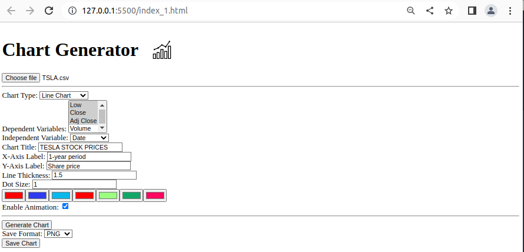
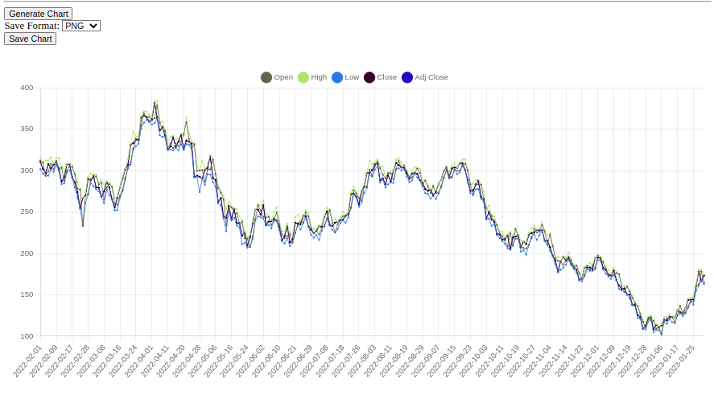

# Chart Generator

Chart Generator is a web application that allows you to generate interactive charts from CSV or XLSX files. It uses the Chart.js library to create various types of charts such as line charts, bar charts, scatter plots, and bubble charts. The application provides a user-friendly interface to select the data, choose chart options, and generate the chart with customizable settings.

 <br>
*Web Interface of the application with different customizations*
<br>

## Features

- Supports CSV and XLSX file formats for data input.
- Multiple chart types to choose from: line chart, bar chart, scatter plot, and bubble chart.
- Select dependent variables (y-axis) and an independent variable (x-axis) from the dataset.
- Customize chart title, x-axis label, and y-axis label.
- Adjust line thickness and dot size for line charts and scatter plots.
- Enable or disable animation for chart rendering.
- Generate interactive charts with zoom and pan functionality.
- Save the generated chart as PNG, JPEG, or SVG format.

 <br>
*Sample look of a visualized CSV file uploaded to the application.*
<br>

## Installation

To use the Chart Generator application, follow these steps:

1. Make sure you have the following dependencies installed:
   - Chart.js: You can include it directly from the CDN using the following script tag:
     ```
     <script src="https://cdn.jsdelivr.net/npm/chart.js"></script>
     ```

   - PapaParse: This library is used for parsing CSV files. Include it from the CDN using the following script tag:
     ```
     <script src="https://cdnjs.cloudflare.com/ajax/libs/PapaParse/5.3.0/papaparse.min.js"></script>
     ```

   - Chart.js Zoom plugin: This plugin enables zooming and panning functionality for the chart. Include it from the CDN using the following script tag:
     ```
     <script src="https://cdn.jsdelivr.net/npm/chartjs-plugin-zoom"></script>
     ```

2. Download the Chart Generator HTML file and save it on your local machine.

3. If you want to use a custom logo, replace the `./img_icons/icons8-chart-50.png` file path with the path to your logo file. Make sure the logo is in the appropriate format (e.g., PNG, JPEG).

## Usage

1. Open the Chart Generator HTML file in a web browser.

2. Click on the "Choose File" button to select a CSV or XLSX file containing your data. The file should have a header row with column names.

3. Select the chart type from the dropdown list (line chart, bar chart, scatter plot, or bubble chart).

4. Choose the dependent variables (y-axis) and the independent variable (x-axis) from the respective dropdown lists. The dependent variables are the columns you want to plot against the independent variable.

5. Customize the chart title, x-axis label, and y-axis label by entering the desired text in the input fields.

6. Adjust the line thickness and dot size (for line charts and scatter plots) by entering a numeric value in the corresponding input fields.

7. Enable or disable animation by checking or unchecking the "Enable Animation" checkbox.

8. Click the "Generate Chart" button to generate the chart based on the selected options. The chart will be displayed in the canvas area below the options.

9. If desired, select the desired format (PNG, JPEG, or SVG) from the "Save Format" dropdown list.

10. Click the "Save Chart" button to download the chart as an image file in the selected format. The file will be saved with the name "chart.png", "chart.jpg", or "chart.svg" depending on the selected format.

## Credits

- Chart.js: https://www.chartjs.org/
- PapaParse: https://www.papaparse.com/
- Chart.js Zoom Plugin: https://github.com/chartjs/chartjs-plugin-zoom

## License

The Chart Generator application is licensed under the GNU License. 